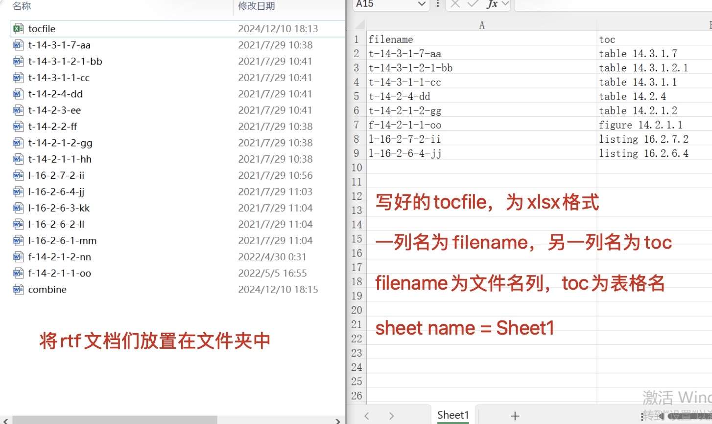
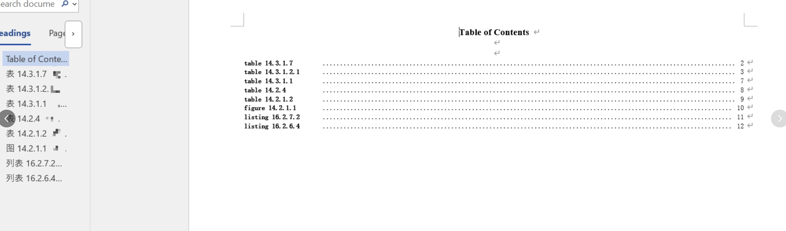

# 用法解释 - combine_rtf

## combine_rtf()

### 功能

将指定的一个或多个文件夹内的rtf文档，按照指定的toc文件进行顺序合并为一个rtf文档，可选择是否加TOC。

### 运行要求

- 提前准备好rtf文档，放置在一个或多个文件夹内；
- 如果有目标TOC，请提供xlsx格式的tocfile（见图片模板样式）；
- 根据实际情况调整row_of_toc_in_a_page参数，如果一页放置不下，请根据结果调整数值。

###  运行步骤

- 填写参数；
- 运行代码

| 参数                 | 意义                                                                                                                                                                     |
| -------------------- |------------------------------------------------------------------------------------------------------------------------------------------------------------------------|
| srcpath              | 需要读取rtf文档的文件夹路径，可以是一个或者多个，写法分别如下：<br />one path: ['C:/folder/example1/'] <br />multiple paths: ['C:/folder/exampl1/', 'C:/folder/example2/']                           |
| inclist              | 指定需要纳入合并的rtf文档，<br />inclist='l-16'，代表仅合并文档名中包含l-16的rtf文档；<br />inclist=None，代表全部rtf文档都纳入合并。                                                                           |
| exclist              | 指定需要排除合并的rtf文档，<br />exclist='l-16'，代表排除合并文档名中包含l-16的rtf文档；<br />exclist=None，代表无需排除任何文档。                                                                              |
| addtoc               | 是否给合并后的rtf文档加TOC，如果需要加则填写为addtoc='Y'，否则填写addtoc='N'。<br />在不提供tocfile时，若addtoc='Y'则程序自动按照table/figure/listing以及文件名的顺序进行排序生成TOC；<br />在提供tocfile时，程序会按照tocfile的顺序生成TOC。 |
| row_of_toc_in_a_page | TOC页面里每页放置行数。请根据生成的文档情况自行调整，若行数溢出页面则会造成文档总页数不正确。<br />若TOC页面每页放置20行则填写：row_of_toc_in_a_page=20                                                                         |
| tocfile              | 如需指定TOC，则填写xlsx格式tocfile的文件夹路径（tocfile具体样式见下文）<br />写法：tocfile=r'C:\Users\tocfile.xlsx'<br />如不指定TOC，则填写为tocfile=None                                                  |
| outpath              | 输出combine后rtf的文件夹路径                                                                                                                                                    |
| outfile              | 输出combine后rtf的文件名                                                                                                                                                      |


### 示例

首先将需要合并的rtf放置在指定文件夹，然后准备tocfile。

tocfile为两列，filename列按照顺序放置rtf名称；toc列是rtf内TFLs的名称；sheet name命名为Sheet1。



运行程序：
```python
from TFLsTool import combine_rtf

combine_rtf(
    srcpath=[r'C:\combine_rtf\docs'], # Source folder path contains .rtf files, one path: ['C:/folder/example1/'], multiple paths: ['C:/folder/exampl1/', 'C:/folder/example2/']
    inclist=None, # 'l-16', .rtf files to be included only, None: all files
    exclist=None, # 'l-16', .rtf files to be excluded
    addtoc='Y', # Add TOC at the beginning of combined file
    row_of_toc_in_a_page=35, # Maximum number of rows in each TOC page
    tocfile=r'C:\combine_rtf\docs\tocfile.xlsx', # If TOC file(2 columns[filename/toc] in Sheet1) provided, use it for TOC
    outpath=r'C:\combine_rtf\output', # The folder to store the combined file
    outfile='combine' # The file name of the combined file
)
```

得到如下结果：

