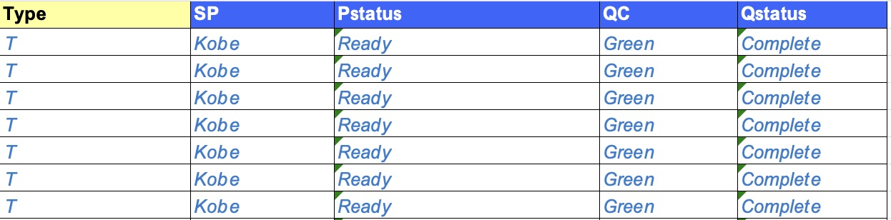

# 用法解释 - completeness_report

## completeness_report()

### 功能

从tracker.xlsx里提取P侧和Q侧完成状态，根据完成状态作图并发送邮件。

### 运行要求

- tracker为xlsx/xlsm格式文件，或能被pd.read_excel函数读取的文件；
- tracker包含表格类型、P侧程序员名称、P侧完成状态、Q侧程序员名称、Q侧完成状态这5列，每行为一张表、列表或图；
- 表格类型的只能填写为T、L、F这三个字母，用来表示Table, Listing, Figure。

### 运行步骤

- 填写参数
- 运行代码

| 参数            | 意义                                                                                                                                                                                                                   |
| --------------- |----------------------------------------------------------------------------------------------------------------------------------------------------------------------------------------------------------------------|
| file_path       | 填写输入tracker路径，注意正斜杠/、文件带后缀。<br />填写示例：file_path = 'C:/document/tracker.xlsx'                                                                                                                                         |
| sheet_name      | 指定sheet页；<br />填写示例：sheet_name = 'sheet'                                                                                                                                                                             |
| ds_select_list  | 指定表格类型、P侧程序员名称、P侧完成状态、Q侧程序员名称、Q侧完成状态这5列；<br />**注意上述顺序不能乱；列名和tracker里一致；**<br />填写示例：ds_select_list=['Type', 'SP', 'Pstatus', 'QC', 'Qstatus']                                                                       |
| ds_status_list  | 指定P侧和Q侧完成的值，比如'Ready for QC'意味着P侧完成，'QC Complete'意味着QC侧完成；<br />填写示例：ds_status_list=['Ready for QC', 'QC Complete']                                                                                                  |
| project         | 项目名称，输出作图的标题；<br />填写示例：project = 'Name of the project'                                                                                                                                                              |
| side            | 只出P侧填写'p'，示例：side='p'；<br />只出Q侧填写'q'，示例：side='q'；<br />两侧都出填写'all'，示例：side='all'；                                                                                                                                   |
| email_sender    | 发件人的邮箱和密码，目前**只支持微软的邮箱账户；注意个人邮箱需要开启SMTP权限；**<br />填写示例：email_sender=['[5211314@outlook.com](mailto:5211314@outlook.com)', 'password']                                                                                |
| email_recipient | 收件人的邮箱，以python列表的形式填写；<br />填写示例：<br />单人：email_recipient=['[5211314@qq.com](mailto:5211314@qq.com)']多人：email_recipient=['[5211314@qq.com](mailto:5211314@qq.com)', '[12345@outlook.com](mailto:12345@outlook.com)'] |
| email_cc        | 抄送人邮箱，写法同收件人邮箱。                                                                                                                                                                                                      |
| outpath         | 作图输出路径，程序运行之前需要**保证该文件夹存在**；<br />填写示例：outpath = 'C:/document'                                                                                                                                                       |


### 示例
有tracker.xlsx如下：

填写参数运行程序
```python
from TFLsTool import completeness_report

completeness_report(
    file_path='./tracker.xlsx',
    sheet_name='sheet',
    ds_select_list=['Type', 'SP', 'Pstatus', 'QC', 'Qstatus'],
    ds_status_list=['Ready', 'Complete'],
    project='Name of the project',
    side='all',

    email_sender = [
        'iamthesender@outlook.com',
        'thisispassword'
        ],
    email_recipient = ['12345678@outlook.com', '5211314@outlook.com'],
    email_cc = ['12345678@outlook.com', 'james@outlook.com'], 
    outpath='./output'
)
```
得到如下结果
