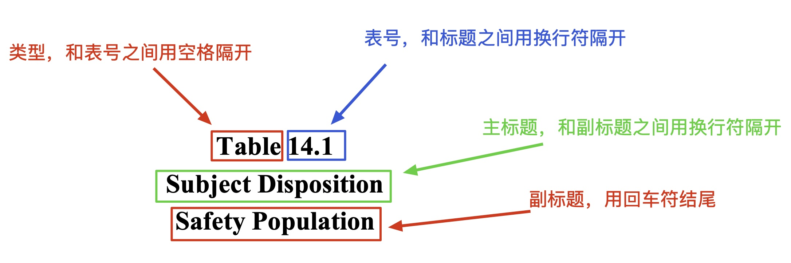

# 用法解释 - extract_shell_to_tracker

## extract_shell_to_tracker()

### 功能

该函数用于提取mock shell内TFLs包括类型、表号、标题、副标题、脚注等信息，并且存储为Tracker，为数统程序员后续输出TFLs做基础。

### Mock Shell要求

为准确稳定的提取信息，本程序对shell有一定要求，具体如下：

期望shell里单个表格包含

* 区域1（类型、表号、标题、副标题）

* 区域2（表格主体）

* 区域3（脚注、编程提示）

其中区域1必需具备。


#### 区域1

1. 类型可以为英文：Table/table/TABLE 或 Listing/listing/LISTING 或 Figure/figure/FIGURE，也可以为中文：表/列表/图，和表号之间用空格隔开；

2. 表号需和标题由换行符分隔，程序内部用正则表达式提取；

3. 标题，和之前的表号、之后的副标题间需用换行符隔开；

4. 副标题，与标题间用换行符隔开，作为区域1的结尾，副标题之后不能跟随换行符，需要用回车符表示结束。

5. 该部分在docx文档的【样式和格式】上应该有别于脚注，如用Heading3或者标题3等。

6. 注意是换行符而非回车符，众所周知在docx文档中，换行符表示文字属于同一段落，而回车符表示不属于同一段落，这点会影响程序对标题的判断。如用其他分隔可填写title_split参数，并且保证表号、标题、副标题之间的分隔符特异，以区别其他。




#### 区域2

无要求，没有也可。

#### 区域3

脚注（footnote）需写为正文或Normal格式，放在表格主体下方即可，请勿放置在页眉页脚内，本程序不具备从docx页眉页脚内提取文字的功能。

编程提示（programming note），需要用斜体或粗体标出以区别脚注，本程序将斜体或粗体的文字识别为programming note。

### 运行步骤

* 首先将文档的修订全部接受；
* 填写参数；
* 随后运行函数；

| 参数                    | 意义                                                         |
| ----------------------- | ------------------------------------------------------------ |
| table_path              | docx文档路径，注意正斜杠/、.docx结尾，如'./project-table.docx' |
| table_conditions_list   | 指识别为区域1段落的条件，python列表写法：<br />[["Table", re.compile(r'\d'), '.']] —— 同时包含Table、数字、和.的部分识别为区域1段落；<br />[["Table", 'x'], ["Listing", 'x']] —— 同时包含Table和x的部分或者包含Listing和x的部分识别为区域1段落。 |
| listing_path            | 写法和table_path相同，如果不需要填写，则写成None或者''       |
| listing_conditions_list | 写法和table_conditions_list相同，如果不需要填写，则写成None或者'' |
| figure_path             | 写法和table_path相同，如果不需要填写，则写成None或者''       |
| figure_conditions_list  | 写法和table_conditions_list相同，如果不需要填写，则写成None或者'' |
| title_split             | 默认为换行符'\n'，如用其他分隔可以用单引号括起来填写，其他分隔需确保表号、标题、副标题之间包含title_split且该值仅在这些部分之间连接，如下图示例，title_split='-'。<br /> |
| language                | 英文文档填写'EN'，中文文档填写'CN'                           |
| output_path             | xlsx输出路径，注意正斜杠/、.xlsx结尾，如'./tracker_results.xlsx' |


### 示例


针对上述文档提取，运行下面的程序：

```python
from TFLsTool import extract_shell_to_tracker

extract_shell_to_tracker(

    table_path='./table.docx',
    table_conditions_list=[["Table", re.compile(r'\d'), '.']], # 包含Table、数字和.的部分识别为区域1提取
    
    listing_path='',
    listing_conditions_list='',
    
    figure_path='',
    figure_conditions_list='',

    title_split='\n',
    language='EN',
    output_path='./tracker_results.xlsx'
)
```

